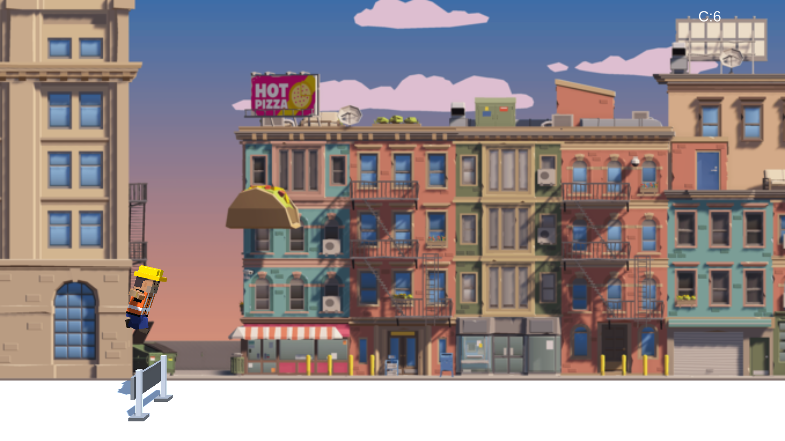

# Build and Sprint

Sprint and Build is a fun mini-game I created as a small project. In this game, the character must jump over or under 20 obstacles to win. Additionally, the character can collect coins along the way to earn extra points.

## How to Play

## Windows users

- Navigate to the "Builds" folder.
- Download the Windows folder.
- Click the BuildandSprint.exe, done!

## Linux users

- Navigate to the "Builds" folder.
- Download the Linux folder.
- Click the Build and Sprint, done!

Here's an image on how it looks like:

I'm going to update the game and make it better in the future.